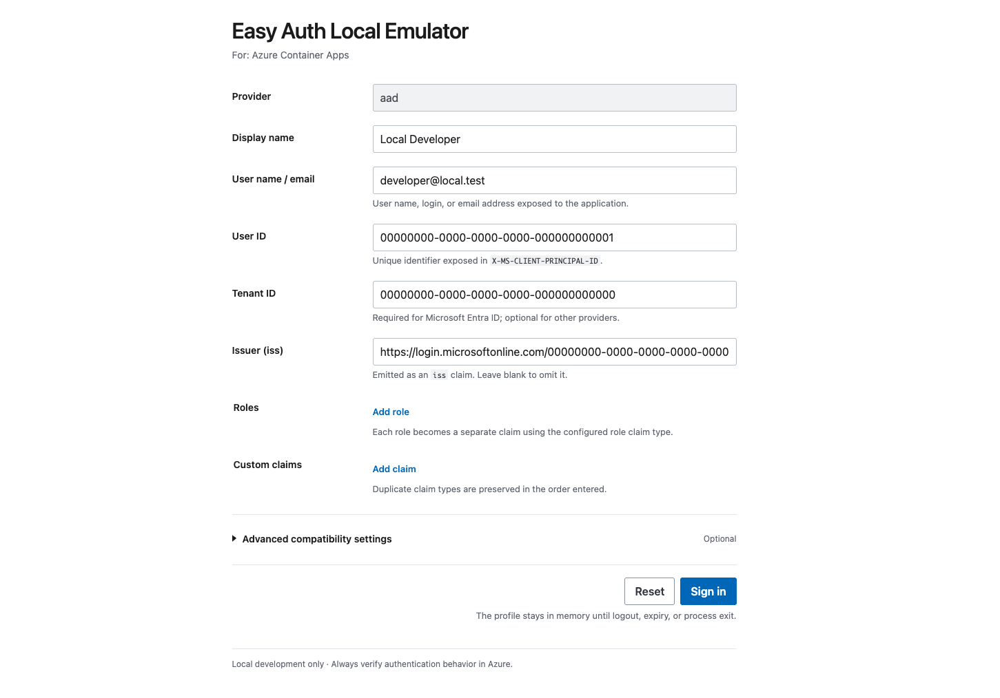

# EasyAuth Local Emulator

<p align="center">English | <a href="README_jp.md">日本語</a></p>

A development proxy that locally reproduces "Azure App Service Easy Auth" and "Azure Container Apps built-in authentication" without a real identity provider.

- Run any local web app behind the authentication proxy.
- Create mock users from the browser or from a configuration file.
- Verify the `/.auth/me` response and forwarded headers your web app uses, before deploying to Azure.
- The emulator handles `/.auth/*` itself, and forwards all other requests to your local app with the required Easy Auth headers attached.




## Quick start

Prerequisites:

- Windows or macOS
- The upstream app listens on `localhost`, `127.0.0.1`, or `::1`

### 1. Download the release

Download the archive for your computer and its matching `.sha256` file from [GitHub Releases](https://github.com/07JP27/EasyAuthLocalEmulator/releases).

| Computer | Identifier in the file name |
|---|---|
| Windows, Intel or AMD | `win-x64` |
| Windows on Arm | `win-arm64` |
| Mac, Apple silicon | `osx-arm64` |
| Mac, Intel | `osx-x64` |

### 2. Verify the download

Before bypassing an operating-system security warning, verify that the archive matches the checksum published with the release. The examples below use `v0.1.0`; replace the version and RID with the files you downloaded.

macOS:

Open the folder containing the downloaded archive and checksum in Terminal. You can type `cd `, drag the folder from Finder into Terminal, and press Return.

```console
shasum -a 256 -c easyauth-v0.1.0-osx-arm64.tar.gz.sha256
```

Continue only if the result ends in `OK`, then double-click the `.tar.gz` file in Finder to extract it.

Windows PowerShell:

Open the folder containing the downloaded archive and checksum in File Explorer, type `powershell` in the address bar, and press Enter.

```powershell
$archive = ".\easyauth-v0.1.0-win-x64.zip"
$expected = (Get-Content "$archive.sha256").Split()[0]
$actual = (Get-FileHash $archive -Algorithm SHA256).Hash
$actual.ToLowerInvariant() -eq $expected.ToLowerInvariant()
```

Continue only if the result is `True`. Extract the archive after verification.

### 3. Install the CLI

#### macOS

Open the extracted folder in Terminal:

1. Type `cd `, including the trailing space.
2. Drag the extracted folder from Finder into the Terminal window.
3. Press Return.
4. Confirm that the executable is in the current folder.

```console
pwd
ls -l ./easyauth
```

`./easyauth` means “the `easyauth` file in the current folder.” If it reports `No such file or directory`, return to the steps above and open the extracted folder.

Install the CLI into `/usr/local/bin`, which is normally on your `PATH`:

```console
sudo mkdir -p /usr/local/bin
sudo install -m 755 ./easyauth /usr/local/bin/easyauth
```

When `sudo` asks for `Password:`, enter your Mac login password and press Return. No characters appear while you type.

Verify the installation with `easyauth --version`. The current macOS release is not signed with an Apple Developer ID or notarized by Apple, so this first run may be blocked by Gatekeeper. The warning is not itself a malware detection, but only override it after confirming that you downloaded the file from this repository and verified its checksum.

Choose either method:

- **System Settings:** Run `easyauth --version` once to trigger the warning. Then open **System Settings → Privacy & Security**, select **Open Anyway** for `easyauth`, confirm, and run the command again.
- **Terminal:**

  ```console
  sudo xattr -d com.apple.quarantine /usr/local/bin/easyauth
  easyauth --version
  ```

See [Apple's Gatekeeper guidance](https://support.apple.com/guide/mac-help/open-a-mac-app-from-an-unknown-developer-mh40616/mac).

#### Windows

In File Explorer, open the extracted folder, type `powershell` in the address bar, and press Enter. Confirm that PowerShell opened the correct folder:

```powershell
Get-Location
Get-ChildItem .\easyauth.exe
```

The current Windows release is not Authenticode-signed. If you open the executable from File Explorer, Microsoft Defender SmartScreen may warn about the unrecognized app. A security policy may also block downloaded files. Only override a warning after confirming that you downloaded the file from this repository and verified its checksum.

Choose either method:

- **Windows UI:** Right-click `easyauth.exe`, open **Properties**, select **Unblock**, and apply the change. If you double-click the executable and Microsoft Defender SmartScreen shows **Windows protected your PC**, select **More info → Run anyway**.
- **PowerShell:**

  ```powershell
  Unblock-File -LiteralPath .\easyauth.exe
  ```

`Unblock-File` performs the same operation as the **Unblock** option in File Explorer. See the [Microsoft `Unblock-File` documentation](https://learn.microsoft.com/powershell/module/microsoft.powershell.utility/unblock-file).
See also [Microsoft's guidance for App & browser control and SmartScreen](https://support.microsoft.com/windows/app-browser-control-in-the-windows-security-app-7b2fd298-bf1d-4e39-97d4-043e94fd5d96).

Install the CLI for your Windows user and add it to the user `PATH`:

```powershell
$installDir = "$env:LOCALAPPDATA\Programs\EasyAuthLocalEmulator"
New-Item -ItemType Directory -Force $installDir | Out-Null
Copy-Item .\easyauth.exe $installDir -Force
$userPath = [Environment]::GetEnvironmentVariable("Path", "User")
if (($userPath -split ";") -notcontains $installDir) {
  $newPath = if ([string]::IsNullOrEmpty($userPath)) { $installDir } else { "$userPath;$installDir" }
  [Environment]::SetEnvironmentVariable("Path", $newPath, "User")
}
```

Open a new PowerShell window, then verify the installation:

```powershell
easyauth --version
```

### 4. Start the emulator

Start the local web app you want to put behind Easy Auth and note its URL. Then run the emulator in another terminal:

```console
easyauth start http://localhost:5173 --open
```

Replace `http://localhost:5173` with your app's URL. To emulate Azure Container Apps, append `--platform container-apps`.

The `--open` option opens the proxy at `http://127.0.0.1:4180`. Set up a mock user at a login URL such as `http://127.0.0.1:4180/.auth/login/aad`.

Always access your app through the proxy while using the emulator. Opening the original app URL directly bypasses Easy Auth. If port `4180` is already in use, specify a different port with `--port`.

To try the executable without installing it, run `./easyauth start ...` on macOS or `.\easyauth.exe start ...` in Windows PowerShell from the extracted folder. The same operating-system warnings may appear. For the macOS Terminal method, target the extracted file with `xattr -d com.apple.quarantine ./easyauth`; on Windows, use the `Unblock-File` command shown above before running it.

## Try it with the sample

If you don't have an upstream app, you can run the bundled sample instead. Running the sample requires the .NET 10 SDK.

```console
dotnet run --project samples/EasyAuthLocalEmulator.SampleApp -- \
  --urls http://127.0.0.1:5173
```

Then start the emulator in another terminal.

```console
easyauth start http://127.0.0.1:5173
```

Opening `http://127.0.0.1:4180` shows the authentication state, the four Easy Auth headers, and the decoded principal. The sample also includes diagnostic endpoints for HTTP, SSE, and WebSocket.

## Commands

```console
easyauth start <upstream-url> [options]
```

| Option | Description |
|---|---|
| `--platform <platform>` | `app-service` or `container-apps`. Defaults to `app-service` |
| `--port <port>` | The proxy port. Defaults to `4180` |
| `--open` | Opens the proxy URL in the default browser after startup |
| `--config <path>` | JSON configuration file |
| `--profile <name>` | Profile within the configuration file |
| `--no-ui` | Uses the selected profile without any UI |

The emulator only listens on `127.0.0.1`, and only allows upstream addresses that point to this same computer.
The platform is chosen on the CLI each time it starts, and is never saved in the JSON configuration.

## Supported platforms

| `--platform` | Reproduces | Default logout-complete URL |
|---|---|---|
| `app-service` | Azure App Service Easy Auth | `/.auth/logout/complete` |
| `container-apps` | Azure Container Apps authentication | `/.auth/logout/done` |

The login screen and the logout-complete screen show the currently selected platform.

> [!NOTE]
> In Azure Container Apps mode, make sure your SPA's client-side router doesn't intercept `/.auth/login/*`. This route must reach the server-side authentication feature.

## Profiles

Mock users you use repeatedly can be saved as JSON.

```json
{
  "$schema": "https://raw.githubusercontent.com/07JP27/EasyAuthLocalEmulator/main/schemas/easyauth-local.schema.json",
  "profiles": {
    "alice-admin": {
      "provider": "aad",
      "displayName": "Alice Example",
      "userName": "alice@example.com",
      "userId": "11111111-1111-1111-1111-111111111111",
      "tenantId": "22222222-2222-2222-2222-222222222222",
      "roles": ["Admin"],
      "claims": [
        { "typ": "department", "val": "Engineering" }
      ]
    }
  }
}
```

```console
easyauth start http://localhost:5173 \
  --config easyauth-local.json \
  --profile alice-admin
```

For automated tests, you can enable the same profile without any UI.

```console
easyauth start http://localhost:5173 \
  --config easyauth-local.json \
  --profile alice-admin \
  --no-ui
```

Existing configurations that omit `provider` are treated as `aad`, and the legacy `upn` field is still accepted. See the [JSON Schema](schemas/easyauth-local.schema.json) for all configuration options.

## Supported identity providers

| Identity provider | Login URL |
|---|---|
| Microsoft Entra ID | `/.auth/login/aad` |
| Facebook | `/.auth/login/facebook` |
| Google | `/.auth/login/google` |
| X | `/.auth/login/x` |
| GitHub | `/.auth/login/github` |
| Apple | `/.auth/login/apple` |

## What your app sees

### Authentication routes

| Route | Purpose |
|---|---|
| `GET /.auth/login/<provider>` | Log in as a mock user |
| `GET /.auth/me` | Get the current identity information |
| `GET /.auth/logout` | Log out |
| `GET /.auth/refresh` | Extend the local session's expiration |

### Forwarded headers

| Header | Content |
|---|---|
| `X-MS-CLIENT-PRINCIPAL` | Base64-encoded JSON containing the claims |
| `X-MS-CLIENT-PRINCIPAL-ID` | User ID |
| `X-MS-CLIENT-PRINCIPAL-NAME` | Username or email address |
| `X-MS-CLIENT-PRINCIPAL-IDP` | Identity provider name |

Any of these headers sent by the client are stripped before forwarding and replaced with the values the emulator generates. The default session lifetime is 8 hours, and sessions are lost when the emulator exits.

## Limitations

- This is for local development only. Do not expose it in production.
- It does not generate real tokens, so it does not reproduce external APIs, conditional access, or actual identity provider authentication.
- Arbitrary OpenID Connect providers, the full set of platform authorization settings, IIS integration, and HTTP/2 / gRPC compatibility are not guaranteed.
- Perform final verification on Azure.

## Learn more

- [Deep Dive](docs/deep-dive.md): architecture, compatibility, security, and development/testing
- [Feasibility research](research/azure-app-service-easy-auth-azure-static.md): research process, comparison with existing tools, and sources
- [JSON Schema](schemas/easyauth-local.schema.json): configuration options and constraints
