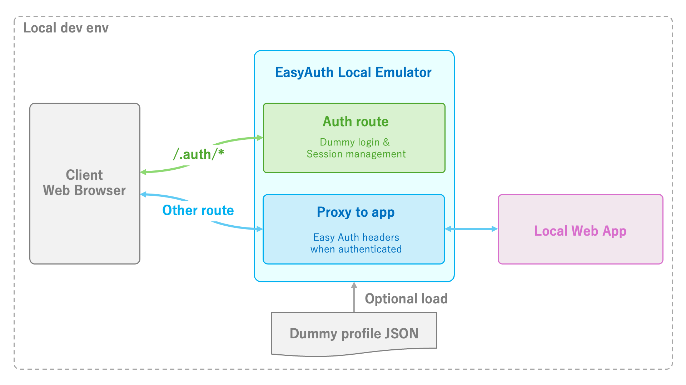

# EasyAuth Local Emulator

<p align="center"><a href="README.md">English</a> | 日本語</p>

「Azure App Service Easy Auth」 と 「Azure Container Apps の組み込み認証」を、実際の ID プロバイダーなしでローカル再現する開発用プロキシです。

- 任意のローカル Web アプリを認証プロキシの後ろで動かせます。
- ブラウザーまたは設定ファイルから模擬ユーザーを作れます。
- Webアプリで使用する `/.auth/me` レスポンスと転送ヘッダーを Azure へデプロイする前に確認できます。
- `/.auth/*` はエミュレーターが処理し、それ以外のリクエストは必要な Easy Auth ヘッダーを付けてローカルアプリへ転送します。




## クイックスタート

前提:

- Windows または macOS
- 転送先アプリは `localhost`、`127.0.0.1`、`::1` のいずれかで待ち受ける

リリース版を使う場合は、[GitHub Releases](https://github.com/07JP27/EasyAuthLocalEmulator/releases) から環境に合うアーカイブを展開し、`easyauth` を実行できる場所へ配置してください。

1. 対象にする Web アプリを起動します。ここでは `http://localhost:5173` とします。

2. 別のターミナルでエミュレーターを起動します。

   ```console
   easyauth start http://localhost:5173
   ```

   Azure Container Apps を再現する場合:

   ```console
   easyauth start http://localhost:5173 \
     --platform container-apps
   ```

3. `http://127.0.0.1:4180` を開きます。

4. `http://127.0.0.1:4180/.auth/login/aad` などのログイン URL で模擬ユーザーを設定します。

ポート `4180` が使用中の場合は、`--port` で別のポートを指定してください。

## サンプルで試す

転送先アプリがない場合は、付属のサンプルを起動できます。サンプルの実行には .NET 10 SDK が必要です。

```console
dotnet run --project samples/EasyAuthLocalEmulator.SampleApp -- \
  --urls http://127.0.0.1:5173
```

続けて、別のターミナルでエミュレーターを起動します。

```console
easyauth start http://127.0.0.1:5173
```

`http://127.0.0.1:4180` を開くと、認証状態、4つの Easy Auth ヘッダー、復号済みプリンシパルを確認できます。サンプルには HTTP、SSE、WebSocket の診断用エンドポイントも含まれます。

## コマンド

```console
easyauth start <upstream-url> [options]
```

| オプション | 説明 |
|---|---|
| `--platform <platform>` | `app-service` または `container-apps`。既定値は `app-service` |
| `--port <port>` | プロキシのポート。既定値は `4180` |
| `--open` | 起動後にプロキシ URL を既定のブラウザーで開く |
| `--config <path>` | JSON 設定ファイル |
| `--profile <name>` | 設定ファイル内のプロファイル |
| `--no-ui` | 選択プロファイルを画面なしで使用する |

エミュレーターは `127.0.0.1` だけで待ち受け、転送先もこのコンピューター自身を指すアドレスだけを許可します。
platform は起動するたびに CLI で選び、JSON 設定には保存しません。

## 対応プラットフォーム

| `--platform` | 再現対象 | 既定のログアウト完了 URL |
|---|---|---|
| `app-service` | Azure App Service Easy Auth | `/.auth/logout/complete` |
| `container-apps` | Azure Container Apps authentication | `/.auth/logout/done` |

ログイン画面とログアウト完了画面には、現在選択している platform が表示されます。

> [!NOTE]
> Azure Container Apps モードでは、SPA のクライアント側ルーターが `/.auth/login/*` を横取りしないようにしてください。このルートはサーバー側の認証機能へ到達する必要があります。

## プロファイル

繰り返し使う模擬ユーザーは JSON に保存できます。

```json
{
  "$schema": "https://raw.githubusercontent.com/07JP27/EasyAuthLocalEmulator/main/schemas/easyauth-local.schema.json",
  "profiles": {
    "alice-admin": {
      "provider": "aad",
      "displayName": "Alice Example",
      "userName": "alice@example.com",
      "userId": "11111111-1111-1111-1111-111111111111",
      "tenantId": "22222222-2222-2222-2222-222222222222",
      "roles": ["Admin"],
      "claims": [
        { "typ": "department", "val": "Engineering" }
      ]
    }
  }
}
```

```console
easyauth start http://localhost:5173 \
  --config easyauth-local.json \
  --profile alice-admin
```

自動テストでは同じプロファイルを画面なしで有効化できます。

```console
easyauth start http://localhost:5173 \
  --config easyauth-local.json \
  --profile alice-admin \
  --no-ui
```

`provider` を省略した既存設定は `aad` として扱い、旧 `upn` も利用できます。全設定項目は [JSON Schema](schemas/easyauth-local.schema.json) を参照してください。

## 対応する ID プロバイダー

| ID プロバイダー | ログイン URL |
|---|---|
| Microsoft Entra ID | `/.auth/login/aad` |
| Facebook | `/.auth/login/facebook` |
| Google | `/.auth/login/google` |
| X | `/.auth/login/x` |
| GitHub | `/.auth/login/github` |
| Apple | `/.auth/login/apple` |

## アプリから見えるもの

### 認証ルート

| ルート | 用途 |
|---|---|
| `GET /.auth/login/<provider>` | 模擬ユーザーでログイン |
| `GET /.auth/me` | 現在の ID 情報を取得 |
| `GET /.auth/logout` | ログアウト |
| `GET /.auth/refresh` | ローカルセッションの有効期限を延長 |

### 転送ヘッダー

| ヘッダー | 内容 |
|---|---|
| `X-MS-CLIENT-PRINCIPAL` | クレームを含む Base64 符号化 JSON |
| `X-MS-CLIENT-PRINCIPAL-ID` | ユーザー ID |
| `X-MS-CLIENT-PRINCIPAL-NAME` | ユーザー名またはメールアドレス |
| `X-MS-CLIENT-PRINCIPAL-IDP` | ID プロバイダー名 |

クライアントが送った同名ヘッダーは転送前に削除し、エミュレーターが生成した値に置き換えます。セッションの既定有効期間は8時間で、エミュレーターを終了すると失われます。

## 制限事項

- ローカル開発専用です。本番環境へ公開しないでください。
- 実トークンを生成しないため、外部 API、条件付きアクセス、実際の ID プロバイダー認証は再現しません。
- 任意の OpenID Connect プロバイダー、platform の認可設定全体、IIS 統合、HTTP/2・gRPC の互換性は保証しません。
- 最終確認は Azure 上で実施してください。

## さらに詳しく

- [Deep Dive](docs/deep-dive_jp.md): アーキテクチャ、互換性、セキュリティ、開発・テスト
- [実現性調査](research/azure-app-service-easy-auth-azure-static.md): 調査過程、既存ツール比較、出典
- [JSON Schema](schemas/easyauth-local.schema.json): 設定項目と制約
